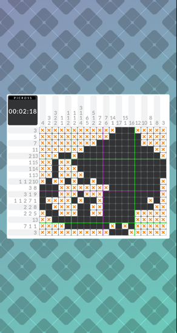

# PICROSS

This is a picross-like game for html5

It supports
- Picross s6 style ui
- Two fingers resize for large puzzle
- Auto save



Game which is forked from `parcel-pixijs-quickstarter` and apply MVC

## Quick start
**Node version >= 8.0 (recommended 10.6.0) and NPM >= 5 (recommended 6.1.0)**

```bash
# clone the repo.
git git@github.com:markkong318/picros.git

# go to the repo
cd picross

# install the dependencies via npm
npm install

# start the server in dev mode with HMR
npm run start
```
go to [http://localhost:1234](http://localhost:1234) in your browser. Done.

DEMO: [https://markkong318.github.io/picross/](https://markkong318.github.io/picross/)

## npm scripts

* `npm run start` - runs the compiler and a server at the same time in dev mode with HMR (Hot Module Replacement) 🔥.
* `npm run build` - runs the compiler once and generates a production build.
* `npm run build_serve` - it makes a build and serves it to port 8080.
* `npm run test` - runs the unit tests (.spec.ts files).
* `npm run deploy` - deploy to github page

## Build your own puzzle

### Prepare

Prepare two same size jpg files (png has alpha channel problem, not suggested)

1. Origin image: Normal color image
2. Answer image: Mark the black block as black (0x000000) and others as white (0xffffff)

Upload to imgur with directly download link

## Upload

The link format should be

```
https://i.imgur.com/jjVYPNF.jpg
```

You could use this tool to get the real imgur url

```
https://imgur-direct-links.herokuapp.com/
```

## Create link

Append the text after `https://i.imgur.com/` as parameter

- origin: Origin image
- answer: Answer image
- title: The text in the clear screen

```
https://markkong318.github.io/picross/?origin=jjVYPNF.jpg&answer=jjVYPNF.jpg&title=WARRIOR
```

## Other parameters

- width: Set the puzzle width
- height: Set the puzzle height
- block: Set the one block px on original image. Picross will divide it automatically
- bgcolor: Convert transparent (color rgb(0,0,0) with 255 transparent) to specific color
- threshold: Gray level threshold for answer image
- god: Set 1 will fill all automatically. It is for debug

## Example puzzles

### https://dotown.maeda-design-room.net/

- earphone:

https://markkong318.github.io/picross/?origin=Sdl2mII.jpg&answer=Sdl2mII.jpg&god=1&block=60&threshold=128&title=earphone&bgcolor=0xFFFFFF

- yellow tree

https://markkong318.github.io/picross/?origin=52VhNdK.jpg&answer=52VhNdK.jpg&god=1&block=60&threshold=200&title=yellow%20tree&bgcolor=0xFFFFFF

- taco

https://markkong318.github.io/picross/?origin=zfeYkdf.jpg&answer=zfeYkdf.jpg&god=1&block=60&threshold=128&title=taco&bgcolor=0xFFFFFF

- green alien

https://markkong318.github.io/picross/?origin=aDBaMGw.jpg&answer=aDBaMGw.jpg&god=1&block=60&threshold=128&title=green%20alien&bgcolor=0xFFFFFF
